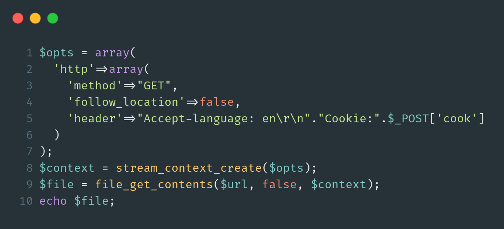

# Securinets CTF Quals 2021 - Mixed

## The Challenge Environment

Starting off to approach this problem we must first understand the overall server setup. We notice from the challenge downloadable that there is a Python Flask API along with some PHP code for the main server. The webserver executing the PHP code is Apache/2.4.38 \(Debian\) while the PHP version is 7.3.27. This is probably [this](https://hub.docker.com/layers/php/library/php/7.3.27-apache/images/sha256-4582b1e676837f4ca79420b5cd0e335bf82ba4fa016f78f29860dd71e969a291?context=explore) docker image.

The python API is running on localhost at the domain `api.prodnotes.bb` while the PHP server passes traffic to it using a very weird method, below we can see exactly that. Its using the `file_get_contents` function on a user supplied URL with some additional stream options and just echoes back the response body.

```php
$opts = array(
  'http'=>array(
    'method'=>"GET",
    'follow_location'=>false,
    'header'=>"Accept-language: en\r\n"."Cookie:".$_POST['cook']
  )
);
$context = stream_context_create($opts);
$file = file_get_contents($url, false, $context);
echo $file;
```

Finally there was also a bot that we could submit URLs to at `/req.php`. This bot was a source of great confusion at first for us and probably other players. As it turns out the bot was not an essential part of the challenge and we will touch a bit more on that later.

## Exploring The Codebase

Here we will explain a bit the thought process of how we ended up discovering _all?_ of the bugs rather than just going directly to them. Move to the next section to read directly the vulnerabilities.

Visiting the website for the first time we are meet with a login form. As we don't have a user yet we try to register but the website is redirecting us back to the index page. We see in the `login_query.php` file that the login process is not vulnerable to SQLi but while digging through the rest of the code, we cannot find anything that will insert a user to the database, thus registering a new user seems pretty impossible now.

The only thing that could be used to login is the functionality in `passwordchange.php` which also doesn't have any CSRF protection. We know there is an admin bot which is very likely to be logged in to the website, so we only need to send a link with some JavaScript payload in it that will make a request to the `passwordchange.php` and change the password to anything we want. After that we can login using our new credentials. Unfortunately as we said earlier this is not needed as the author forgot to include the `exit` keyword to the top of both `home.php` and `get.php` after the session start, this means loging in is not necessary to proceed to the next step. From our understanding the encrypt and decrypt functionality found on those pages and on the Flask API was also meant to prevent CSRF, so we can ignore it from now on.

After that we went on to explore the note taking aspect of the challenge. The Flask API contained 2 endpoints, one that can be used to insert a note to the sqlite database `/add_note` and another that can be used to read the available notes at `/get_note` . Logically we first tried to create one note of our own and then read it, as that was working fine we thought maybe there is some hidden note that we should read. We made a quick script to bruteforce all the notes while working on understanding the code more. In the end our script found nothing really interesting.

Subsequently we thought that maybe the flag is on the admin cookies or on the admin page since there was a XSS payload in the dummy sqlite database given in the downloadable. After some time we concluded this was impossible to do, escaping the rabbit hole :\).

Taking some time to find what to do next we concluded that the flag will probably be stored on the filesystem.

## Vulnerabilities

### Arbitrary file read

Now targeting the filesystem we knew we had to abuse the `file_get_contents` function to read some files. First we checked if the context parameter will have any effect if we pass a `file://` URL.

```php
$url = "file:///etc/passwd";
$parsed_url = parse_url($url);
var_dump($parsed_url);

$opts = array(
    'http'=>array(
        'method'=>"GET",
        'follow_location'=>false,
        'header'=>"Accept-language: en\r\n" ."Cookie:".$_POST['cook']
    )
);

$context = stream_context_create($opts);
$file = file_get_contents($url, false, $context);
echo $file;
```

Hopefully PHP here reads `/etc/passwd` just fine. The problem is now that the challenge doesn't let us just supply any URL we want, we need to bypass the check function.

```php
function check($url){
    $par=parse_url($url);
    if (((strpos($par['scheme'],'http')!==false)and($par['host']=='api.prodnotes.bb'))and($par['port']==5000)){
        return True;
    }
    else{
        return False;
    }
}
```

We notice something weird this this function, while it checks exactly that the host and port will match the local Flask API `api.prodnotes.bb:5000` , the scheme part of the URL is checking that it **contains** the string `http` . We know there must be some bug in `parse_url` so we did some googling and found out [this](https://blog.theo.com.tw/Research/PHP-The-issue-between-parse-url-and-real-path/) very interesting blog describing a very similar scenario to the one we face. Reading carefully the blog we see that while the payload works as verified locally, it doesn't parse the **host** value.

We needed to find a way to trigger the vulnerability described in the blog while also tricking the `parse_url` . After many many tries we realized the `\\` are not really necessary but the big realization was that the check function only needs the scheme to **contain** `http` meaning a scheme of `shttp` would pass the check just fine!!

```http
shttp://api.prodnotes.bb:5000/../../../../../../../../../../etc/passwd
```

Testing it locally in the previous PHP script, it works!!

### RCE

After trying many common flag locations we realized we needed to go one step further and get RCE to find and read the flag.

#### Flask debug mode

Looking at the Flask code we can see its running with debug mode specifically enabled, which means that the **werkzeug** debug console is enabled. We can easily check if we have access to it by just changing the `endpoint` parameter of a POST request to `/get.php` from `/get_note` to `/console` , surely enough we get back the werkzeug console html.



#### Calculating the PIN

We can see it requires a pin in order to let us execute python code. Luckily there are plenty of blogs out there that describe the process of calculating this pin, the best one we found was [this](https://lactea.kr/entry/python-flask-debugger-pin-find-and-exploit).

To generate this we need 2 lists of data, our `probably_public_bits` turned out like this:

```python
probably_public_bits = [
    "root",
    "flask.app",
    "Flask",
    "/usr/lib/python3/dist-packages/flask/app.py",
]
```

The first 3 items were easy to guess, the 4th took some tedious trial and error until we found it.

Moving to the `private_bits` lists we first need the MAC address of the default interface which we can find by reading the file `/proc/net/route` and then based on the interface name read the suitable file, on our case, `/sys/class/net/eth0/address`. Secondly we need the private machine id, we wasted some time reading and calculating the pin based on the `/etc/machine-id` and `/proc/sys/kernel/random/boot_id` without realizing like the blog said, that on some newer werkzeug versions a new random id is used and that is found in `/proc/self/cgroup` . This was [CVE-2019-14806](https://nvd.nist.gov/vuln/detail/CVE-2019-14806).

We can verify our version is using the cgroup variant by reading the file `/usr/lib/python3/dist-packages/werkzeug/debug/__init__.py` . There we can also find the last piece of the puzzle which is the `hash_pin` function. The pin we got from all this is `160-338-026` 

#### Header Injection

While the PIN we got is probably correct, it is not enough as is, to get RCE. We need to create the werkzeug cookie header. Below is a typical console debug request.


The cookie value there is in the form:

```python
f"__wzd{hexdigest}={int(time.time())|{hash_pin(pin)}"
```

The cookie key name can be found in the same code that [generated](https://github.com/pallets/werkzeug/blob/master/src/werkzeug/debug/__init__.py#L188) the pin and the `hash_pin` function we extracted is:

```python
def hash_pin(pin):
    if isinstance(pin, text_type):
        pin = pin.encode('utf-8', 'replace')
    return hashlib.md5(pin + b'shittysalt').hexdigest()[:12]
```

Now all we need to do is just inject this cookie header into the `cook=` post parameter with some CRLF and make the final endpoint URL like this:

```text
/console?__debugger__=yes&cmd=print(1337)&frm=0&s=xOGQOt4mS7oDWEs8P5AT 
```


## Attributions

This challenge was solved along with @[makelariss](https://twitter.com/makelariss) and @[makelarisjr](https://twitter.com/makelarisjr).

### References

* [https://blog.theo.com.tw/Research/PHP-The-issue-between-parse-url-and-real-path/](https://blog.theo.com.tw/Research/PHP-The-issue-between-parse-url-and-real-path/)
* [https://lactea.kr/entry/python-flask-debugger-pin-find-and-exploit](https://lactea.kr/entry/python-flask-debugger-pin-find-and-exploit)
* [https://github.com/pallets/werkzeug/blob/master/src/werkzeug/debug/\_\_init\_\_.py\#L126](https://github.com/pallets/werkzeug/blob/master/src/werkzeug/debug/__init__.py#L126)
* [https://github.com/pallets/werkzeug/blob/master/src/werkzeug/debug/\_\_init\_\_.py\#L442](https://github.com/pallets/werkzeug/blob/master/src/werkzeug/debug/__init__.py#L442)
* [https://github.com/python/cpython/blob/master/Lib/uuid.py\#L642](https://github.com/python/cpython/blob/master/Lib/uuid.py#L642)

